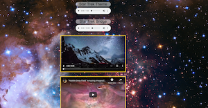

# Sharing Media: Images, Favicon, Video (hosted and embedded), Audio

In this assignment we'll add images, audio and video to a web page.  We've added images using the `img` tag so that won't be covered, but we'll use CSS to add and image in the background and fix it so that it doesn't change as you sroll over the page.  This is sometimes called the "Parallax Effect".  We'll also use an image to create a favicon.  Favicons show up in the browser tab along with the page `title`.  They help the user identify your website. The image for the favicon was created by taking a screen shot of a some text in a word doc and sizing it to 100px x 100px.

HTML5 provides `video` and `audio` tags.  If you're hosting your own video you can use the video tag. Not all browsers support all video formats.  The common ones are .mp5, webm and .ogg.  The video tag has nested `src` tags where you can specify multiple files formats depending on what you're hosting.  For this assignment we're only host .mp4 and it works in Safari, FireFox, Chrome and Edge.  

Audio is host with the same set of tags whether you are hosting the audio or referencing audio on the web. When you want to reference video on the web you would use and `iframe` tag. In the case of YouTube you can get this from their sharing link.

There are many options associated with the `video`, `audio` and `iframe` tags.  For instance you may want to loop you video and there is an attribute for that.  There are some links to sites that use background video.

It can be challenging to serve video responsively.  In this assignment we'll use Flexbox to control our video and iframe elements, as well as the audio elements.

## Assignment
You have a partially completed index.html provided.  You will need to add the media tags and then style the project.  There are comments with numbers to help locate which media items goes in which article.  You'll find all the media in the media folder.

### HTML

1. For the first audio add the track with the Star Trek main theme that you'll reference on the web.

```
<audio controls>
  <source src="http://trekcore.com/tos/audio/themes/OriginalSeriesMainTitle.mp3" type="audio/mpeg">
  Your browser does not support the audio element.
</audio>
```
2. For the second audio add the track with the bridge noises that you're hosting locally.
```
<audio controls>
  <source src="media/tos_bridge_season_3.mp3" type="audio/mpeg">
  Your browser does not support the audio element.
</audio>
```
3. For the first video (item #3), add a video tag source that you are hosting locally.  Notice we only have one source.  Many times you'll see multiple sources with different formats.
```
<video width="560" height="315" controls>
    <source src="media/Time Lapse Video Of Night Sky.mp4" type="video/mp4">
    Your browser does not support the video tag.
</video>
```
4. For the second video (item #4), add an iframe with a youtube video about the hubble spacecraft.
```
<iframe width="560" height="315" src="https://www.youtube.com/embed/vY9H7zAofmA" frameborder="0"
  allow="accelerometer; autoplay; encrypted-media; gyroscope; picture-in-picture" allowfullscreen>
</iframe>
```  
5. For the third video (item #5), add an iframe with a youbut video about the Enterprise bridge.
```
<iframe width="560" height="315" src="https://www.youtube.com/embed/UKBvaOLDem0" frameborder="0"
  allow="accelerometer; autoplay; encrypted-media; gyroscope; picture-in-picture" allowfullscreen>
</iframe>
```
6. Add a favicon tag in the <head> section
```
  <link rel="icon" href="wats.png" type="image/ico">
```
#CSS 

1. Add a CSS file and link to the index.html. Reset the browser defaults and set the screen to full height.
```
 * {
      box-sizing: border-box;
      padding: 0;
      margin: 0;
    }

    html,
    body {
      height: 100vh;
    }
```  
2. Use a background image to fill the screen by applying it to the body element.
```
body {
      background-image: url("media/hubble-heic1509a.jpg");
      background-repeat: no-repeat;
      background-attachment: fixed;
      background-size: cover;
    }
```
3. Use Flexbox to align the media to the center vertically.
```
 section {
      display: flex;
      flex-direction: column;
      align-items: center;
    }
``` 
4. Put a border around the videos.
```
 video,
    iframe {
      border: 5px solid gold;
    }
```
5. Style the paragraph describing each audio. Note the use of a translucent background to improve text contrast.
```
.embedded-audio p {
      text-align: center;
      font-size: 2rem;
      font-family: Arial, Helvetica, sans-serif;
      background-color: rgba(255, 255, 255, .5);
      color: black;
      border-radius: 30px;
      margin: 10px 0;
    }
```
6. Provide some separation between articles.
```
article {
  margin: 1rem 0;
}
```
## Resources

[W3 School Parallax Effect](https://www.w3schools.com/howto/howto_css_parallax.asp)
[W3C Add a Favicon to your Site](https://www.w3.org/2005/10/howto-favicon)
[Mozilla audio](https://developer.mozilla.org/en-US/docs/Web/HTML/Element/audio)
[Mozilla video](https://developer.mozilla.org/en-US/docs/Web/HTML/Element/video)
[Mozilla iframe]()

[Background Video](https://newflight.co/)
[Background Video](https://www.lechomat.com/en/)
[W3 Schools Creating full screen video](https://www.w3schools.com/howto/howto_css_fullscreen_video.asp)

## Solution
### Large screen
  


### Mobile