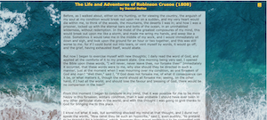

# Fixed Positioning

Unlike **absolute** positioning which anchors an element to a position that is relative to it's container, **fixed** positioning anchors an element to the screen.  This is used a lot, when you site has scrollable pages, but you want to make certain link (user actions) available no matter where the user is within the document.  There are some links in the resources section that show examples of using fixed positioning.

If you run preview the index.html page in this assignment, you'll see a very small blue icon in the upper left corner.  We'll make that icon larger, color it and fix it to the right corner of the page.  It provide a link to the novel from which the contents of the page were extracted.

## Assignment

1. You've been provided with index.html linked to a style.css.  All that you need to do is style the fontawesome icon. Add the following to the linked CSS files.  The `position:fixed` tells the browser that the item will be fixed to a location on the screen. The `top` and `right` properties describe the position.  A `cursor:pointer` is added to let the user know the icon is clickable.
```
.fa-book {
  font-size: 2rem;
  color: gold;
  position: fixed;
  top: 2%;
  right: 2%;
  cursor: pointer;
}
```
2. Preview the page in large and mobile widths.  Scroll to see that the book icon sticks to the upper right corner of the page when you scroll.


## Resources
[Site which uses fixed positioning](https://www.multimedios.com/)  
[Site which uses fixed positioning](https://webplatform.github.io/docs/tutorials/absolute_and_fixed_positioning/)

## Solution

### Large Screen  
  

### Small Screen  

