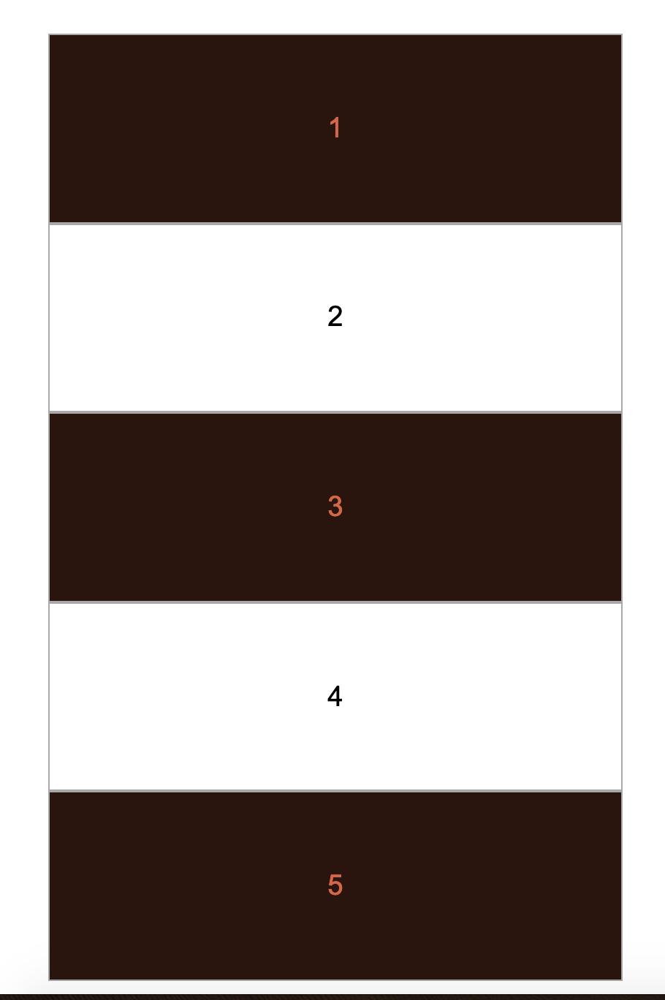
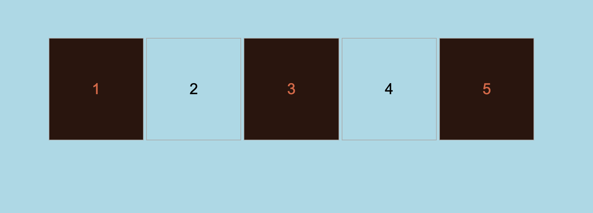

# Media Queries

Media queries allow us to change the style (layout, look, images, show/hide) of our website depending on the media that renders it.  The media query selector can be used to identify the size of the device or even the medium, for example print vs digital, on which modify the style. 

## Responsive Layout

Responsive web design dictates that our web content should be accessbile on all screen sizes, which means all devices sizes. We can follow one of these two policies
1.  **Progressive Advancement**: design the product for the lower quality device and then enhance for larger or higher quality device
2. **Graceful Degradation**: design the product for an advanced device and then gracefully degrade to run on a smaller or lower quality device  

It turns out the **Progressive Advancement** is the winner and so you should build your default CSS code to work on mobile devices and then use media queries to provide the enhanced view. The net result is that you will often provide a default vertical layout for your content, and then add media queries using `float`, `inline-block`, and other one and two dimensional layouts.  

We'll learn some additional techniques to achieve both horizontal layout for larger devices and vertical layout for smaller devices in this skills set when we study the `flex` and `grid` layout techniques.

### Assignment  

1. You've been provided an index.html file with an unordered list of 5 items.  The items are currently laid out vertically with bullet points. We want them to remain vertical by default but add the dimensions and styles the we provided in the **skills-2-css-variables** problem.  We then want to use a media query the gives us a horizontal layout when the screen size is greater than or equal to 700px.  Add a style sheet and use the directions from the CSS variables assignment to provide all styling except those that create a horizontal layout of list items.
```
  * {
    box-sizing: border-box;
  }
  body {
      height: 100vh;
  }
  ul {
    width: 80%;
    height: 10rem;
    margin: 5rem auto;
    padding: 0;
    list-style-type:none;    
  }
  li {
      text-align: center;
      font-size: 24px;
      font-family: Arial, Helvetica, sans-serif;
      font-weight: 400;
      height: 10rem;
      line-height: 10rem;
      border: 1px solid darkgray;
    }
```
1. Add a media query for screens >= 700 px and make the background color light blue for larger screens.  Once you've added this style, use dev tools to test the effect of larger and smaller screen sizes on background color.  A sample media query with background color is below. Notice that `min-width` is used to apply styles for screens sizes that are greater than the supplied value.  What property might you use for **Graceful Degradation**?
```
@media only screen and (min-width: 700px) {
  body {
    background-color: lightblue;
  }
}
```
2. Move all properties that create a horizonal layout of list items into the media query.  There should just be two properties that move into the media query: the `display:inline-block` and the `width: 19%`.
Add the following to your media query:
```
li {
  width: 19%;
  display: inline-block;
}
```
3. Test your web page.

### Solutions  


**Devices <700px**  Mobile  


**Device >=700px**  Desktop or Tablet  


