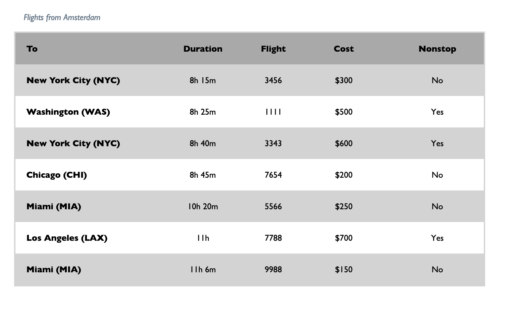

# Tabular Data  

## Table Tags shoult NOT to be used for layout

We've used the CSS `display:table`, `display:row`, and `display:cell` so that we could use a table metaphor for layout because we like to think in terms of rows and columns for layout.  There is a set HTML tag that are used to create a table when we are displaying tabular data like numbers or data that you might see in a spreadsheet or database table.  The HTML `table`, `tr` (table row), `td` (table data), `th` are not meant to be used for layout. They are semantically intended for data.  

In this exercise we'll create a table for tabular data.  Tables are not responsive by nature.  Their size is dictated by their contents.  To make our table more repsonsive we'll put it  in a container that allows us to scroll horizontally.  We'll also set a height on our table, and set an overflow property so that we can scroll vertically.  

We'll also add features to the table to increase its accessbility: captions to the table and scope to the headers.

## Assignment  

### HTML 

1. Create an HTML File and build a table structure
```
table
  caption
  thead
    tr
      th...
  tbody
    tr, th, td...
```
2. The caption is **Flights from Amsterdam**
3. The `th` in the `thead` should be **To**, **Duration**, **Flight**, **Cost**, **Nonstop**.
4. Add data from `table-content.txt` file.  The data in the text file is in order and you should be able to wrap with `th` or `td`.
5. All header data in `thead` should use the `th` tag.  All city names in `tbody` should use the `th` tag. The rest of the data in `tbody` should use the `td` tag.
5. For the `th` in the `thead` provide a `scope="col"` attribute and for the `th` in `tbody` provide a `scope="row"` attribute.
6. Wrap the entire `table` element in a `div` with a class named `container`.  We can use the container to help make the tabular data more responsive.

### CSS 
1. Add a style sheet to the index.html
2. Tables are not responsive in themselves but we can make the table data accessible by providing a horizontal scroll bar. We create a horizontal scroll bar by setting a width on the container and setting the overflow in the X direction to auto. A little horizontal padding is applied.
```
.container {
      padding: 0px 5%;
      width: 70%;
      overflow-x:auto;
    }
```
3. Apply styles directly to the table tag.  If you had multiple tables on your page, you might want to give the table class names for specificity   
  - `border-collape:collapse` to remove gaps between rows and columns. Set the table width to 100%.
  - set `table-layout` to `fixed` to tell the browser to judge cell width based on header content. This can really improve rendering speed on large tables.
  - look and feel
    - background color should be `darkgray`
    - border should be a 3px, solid `lightgray` line
    - font family is `'Gill Sans', 'Gill Sans MT', Calibri, 'Trebuchet MS', sans-serif;`
4. Styling the `caption`.  Apply the following styles to the caption tag directly.
  - 2% padding in all directions 
  - font style italic
  - place the caption at the top left by setting `caption-side` to `top` and `text-align` to `left`
  -  set color to `#667788`
  - set letter spacing to 1px for readability
5. Because we have a fixed size table we can set width dimensions on the `thead` elements and they will apply to the whole table.  We have 5 columns in the table so create 5 entries and set the width of each entry according to the following spec: col 1: 30%, col 2: 20%, col 3:10%, col 4:20%, col5: 20%.  The percentages should add up to 100%. The col 1 entry is shown below
```
thead th:nth-child(1) {
  width: 30%;
}
```
6. Assign `text-align:center` to all `tbody td` to make all data in the body of the table centered. Make the col 1 text left aligned by adding the `text-align: left` to the thead `th:nth-child(1)` style shown above.
7. Provide data cell spacing by adding a padding of `20px` to all sides of the `th` and `td`.
8. Zebra strip the row by adding alternating colors for odd and even rows (shown below).
```
tbody tr:nth-child(odd) {
  background-color: lightgray;
}

tbody tr:nth-child(even) {
  background-color: white;
}
``` 
### Test
Compare your table to the once shown in the image below.  Also test in the browser, using dev tools, to see if the table has a horizontal scroll at lower image sizes.

### Solution  




