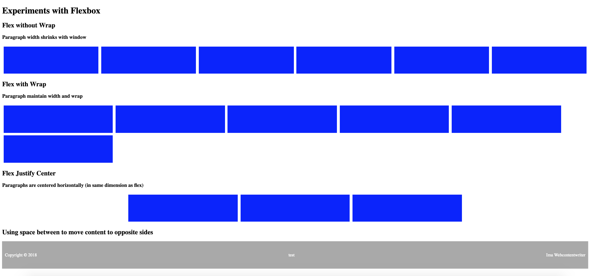

# Flexbox Layout

In the early days of web development, we used tables (literally the `<table>` tag) to provide layout.  This was both semantically incorrect and came with many challenges as that was not what they were designed for.
While the use of Float and Positioning were big improvements there were challenges with those layout implementations.  For historical reference, see this article from List Apart [In Search of the Holy Grail](https://alistapart.com/article/holygrail).  

Flexbox was 7 years in the making and the spec was released in 2015.  It wasn't really fully implemented in most popular browsers until 2017. As Responsive design became more important after the release of the iPhone in 2007, web developers were looking for not only a good layout, but a layout that could be responsive.  

## Flex is Responsive
Flexbox aids responsiveness in two ways:
1. Flexing a container will call block elements to fit themselves in to the container and adjust at different screen widths.  
2. Flexbox contains a wrap property that allow the items in the container to maintain their width, but wrap when the container shring.  

## Flex helps with centering  
There are many CSS properties concerned with or which can be used to center, such as `text-align: center` and `margin: 0 auto`.  Flex makes centering in the dimension your flexing easy with `justify-content: center`.  A container can flex its items vertically or horizontally and the `justify-content` property applies the the direction flexed (the default flex direction is row or horizontal).

## Flex helps with alignment
Some centering and alignment tasks were previously very difficult and sometimes required using JavaScript to take measuresments and update the code as the screen size changed.  For example to maintain content that both horizontally and vertically centered.  We can now easily do this by applying both `justify-content: center` and `align-items: center` to the same container.  

We can also use force the items in our container to spread out or move the edge of the screen using `justify-content: space-around`, `justify-content:space-betweeen` and more.

## Reference  
[MDN Flexbox](https://developer.mozilla.org/en-US/docs/Learn/CSS/CSS_layout/Flexbox)  

[W3 Schools Flexbox](https://www.w3schools.com/Css/css3_flexbox.asp) 

[Flexbox Froggy - a game for learning Flexbox](https://flexboxfroggy.com/)


## Assignment
In this assignment we experiement with a few flex configurations that solve common problems. In this assignment you are provided HTML and CSS files and you'll update the CSS files with flex styling to experiment with the different properties.   
1. Flex without Wrap: If we flex the items in a container without wrap, they will shrink to fit the container.  To see this effect, find the `div` under the header **Flex without Wrap** and add a class `flex-nowrap`. Then add a `flex-nowrap` rule to the CSS file which contains the declaration block `display:flex`.

2. Flex with Wrap:  If we add the declaration block `flex-wrap`, the items in a flexed container will maintain their size but wrap to the next dimension.  If the flex is row (default), this means the next line and if its column, this means the next column.  To see this effect, find the `div` under the header **Flex with Wrap** and a `flex-wrap` rule with both `display:flex` and `flex:wrap` declarations.

3. Flex Justify Center: It's often useful to center items in a container and the `justify-content` property can help with this.  To see this effect, find the `div` under the header **Flex Justify Center** and add a class `flex-center`.  then add a `flex-center` rule to the CSS file which contains the declaration block `display:flex; justify-content:center;`.  

4. Moving content to opposites sides of the screen: You'll encounter many situations where you want to align content to opposite sides of the screen.  In this experiment you'll align content to the right and left sides of the footer as well as placing some content in the center. You should find an unordered list in the footer of the HTML with a class of `copyright`. There also declaration blockes for the copyright and footer in the CSS file. We want the copyright information to be both horizontally and veritcally centered.  In order to get the vertical centering the flexed container must have a height.  The unordered list is flexing the list items, so add to the existing `ul.copyright` rule a declaration for `height: 100%`.  This will cause it to fills its parent container, the footer which has a heighth of 100px.  Then to get the centering effect add these declaration blocks to the `ul.copyright`: 
``` 
  justify-content: space-between;
  align-items: center;  
```  

### Solution

