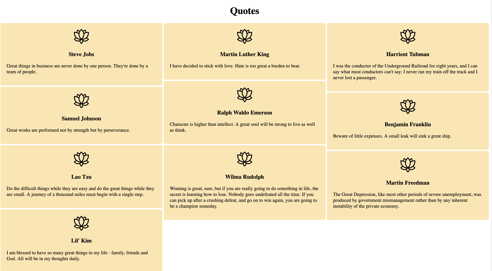
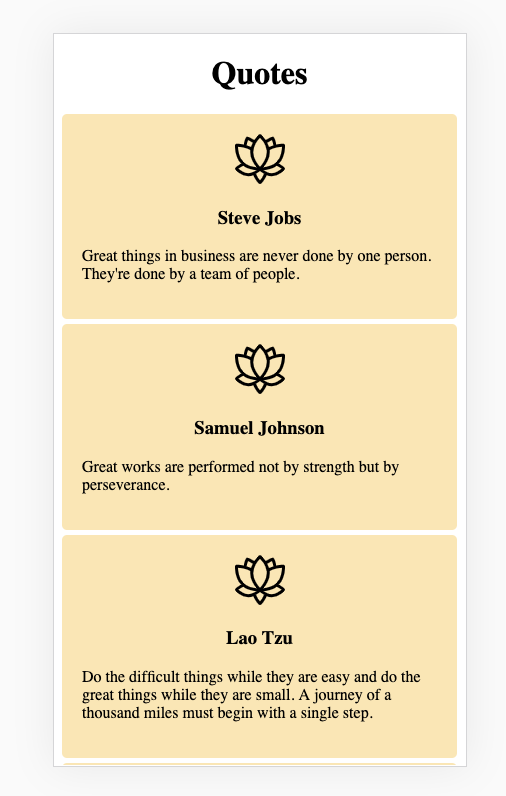

# Column Layout: masonry effect

Column layout produces a page that resembles a newspaper.  Rather than forcing items to fit into exactly the same size containers, like a grid, the lenghts of the column items can vary.  It's often nice to prevent the contents within an item at the bottom of the column from wrapping up to the top of the next column. 

This effect has been called the masonry effect and often solved using JavaScript.  We'll use the CSS `column` property to create the effect. There is a link to a JavaScript library that provides this effect for comparison.

## Assignment
1. Start by adding the class `"mason"` to the section tag in the HTML.
2. Center the header.
```
 h1 {
      text-align: center;
    }
```
3. Provide a width and height to the image.
```
 .mason img {
      height: 50px;
      width: 50px;
    }
```
4. Center the image and quote author.
```
.mason div,
    .mason h3 {
      text-align: center;
    }
```
5. Style the article container.
```
.mason article {
      padding: 20px;
      margin-bottom: 5px;
      border-radius: 5px;
      background: #FBE7B2;
}
```
6. Provide a rule to prevent an article at the bottom of a column from breaking and rendering at the top of the next column. The extra "webkit" property is provided as they may not have adopted the spec'd property `break-inside` yet.
```
.mason p,
    .mason article {
      -webkit-column-break-inside: avoid;
      break-inside: avoid-column;
    }
```
7. Provide a rule that places items in 3 columns with a width of 200 px and a column-gap of 5px.
```
 .mason {
      column-count: 3;
      column-width: 200px;
      column-gap: 5px;
    }
```
8. Provide some footer styling.
```
footer {
      margin: 30px 0;
    }
```

View your work on a large screen and using dev tools, on a mobile screen.  Notice that the browser creates a single column on smaller screens without specifying a rule.

## Resources  
[Mozilla Column CSS] (https://developer.mozilla.org/en-US/docs/Web/CSS/columns)
[Masonry](https://masonry.desandro.com/)

## Solution

### Large Screen



### Small Screen

